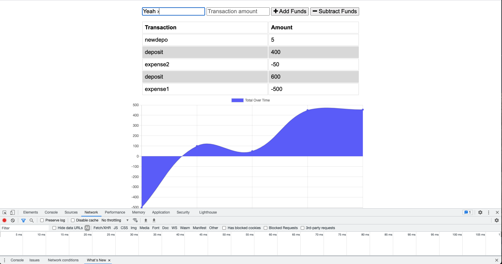
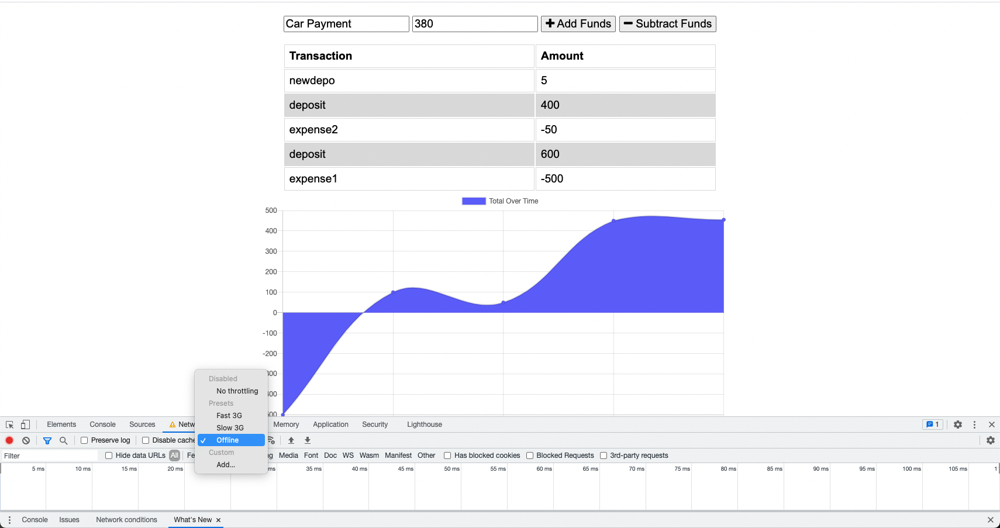
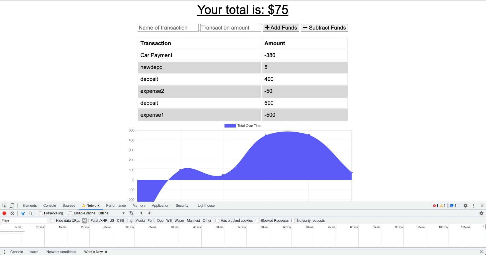
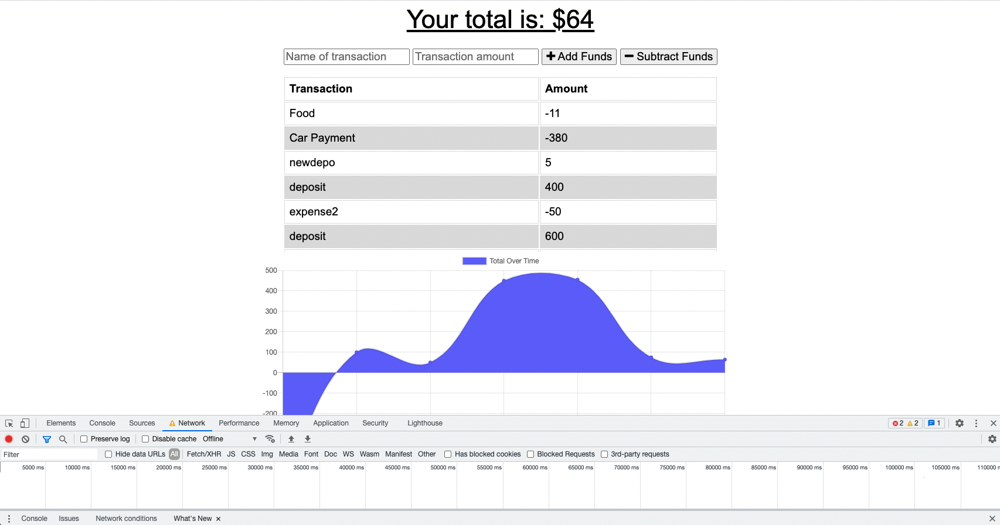
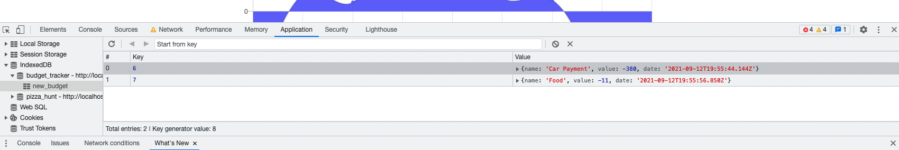
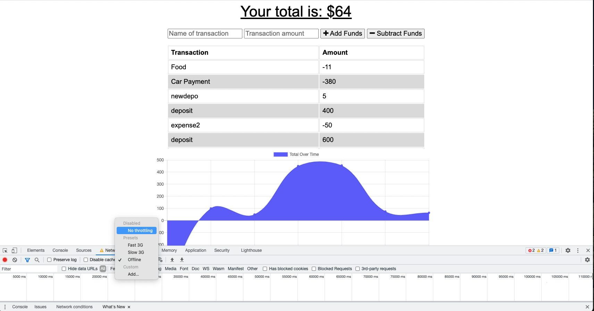
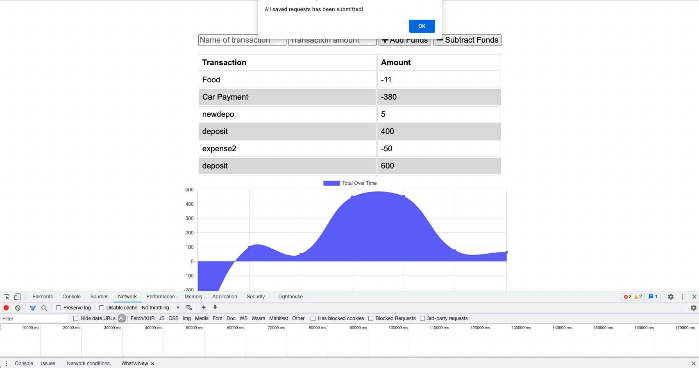
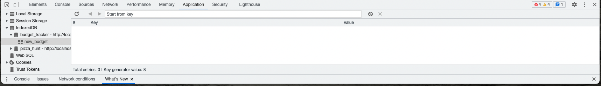

# Budget Tracker Starter Code

## Description 

The purpose of this project was to give the budget tracker app offline functionality. With that said, it was necessary to create a idb and service worker file which help in caching requests when the server is offline. The application now has online and offline functionality. When the user's internet connection is off, they can still add items to their budget and see their balance. Once their internet connection is restored, those reqeuests are sent to the database and cleared from the cache. 

## Screenshot
 
 

## Link 

https://trackabudget.herokuapp.com/ 